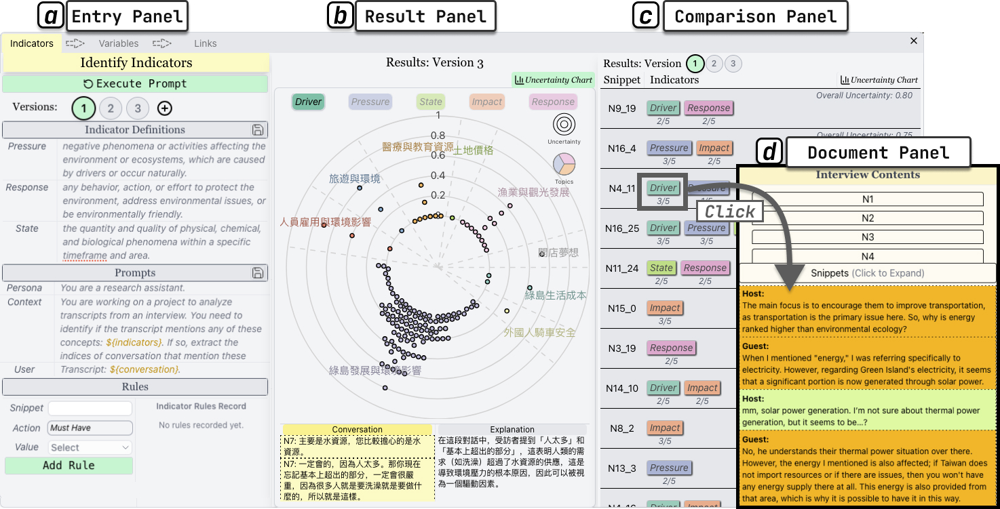
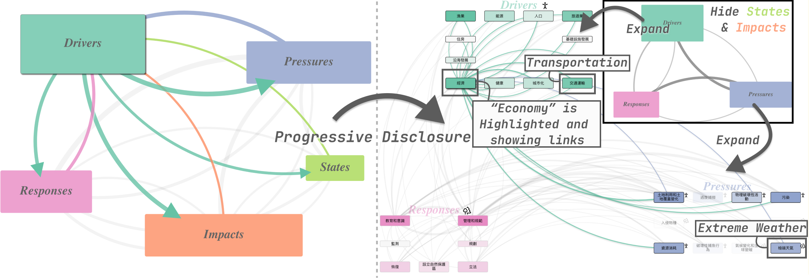

# GreenMine

This is the open-source repository for GreenMine, introduced in the paper titled: **Visual Text Mining with Progressive Taxonomy Construction for Environmental Studies**




## Reproduction Guide

Since reproducing the system from scratch costs API tokens for querying GPT models, you can start directly from [Step 3](#3.-launching-back-end) with the pre-generated data.

**Disclaimer:**
For privacy reasons, we can not release the original data as shown in the paper. Therefore, the data available here is synthetically generated by gpt-4o-mini, and are only provided to demonstrate the visual components of the system, rather than for practical usage.

### 1. [Generating Synthetic Data](synthetic_data/README.md) (Optional)

### 2. [Preprocessing](preprocessing/README.md) (Optional)

### 3. Launching Back-end

1. Request for an OpenAI's api key, and then create a file called `openai_api_key` (no file extension needed) under the directory `server/`. Copy and paste your api key into the file.
1. Under the directory `server/`, execute the following command:

```bash
pip install -r requirements.txt
flask run
```

3. The backend should be launched at `localhost:5000`. You can check by accessing `localhost:5000` in your browser, you should see `Hello GreenMine` showing on the web page.

### 4. Launching Front-end

1. Install `Node.js`
2. Under the repository root directory, execute the following command:

```bash
npm i
npm run dev
```

3. The front-end should be launched at `localhost:5173`. You can access it in your browser.
